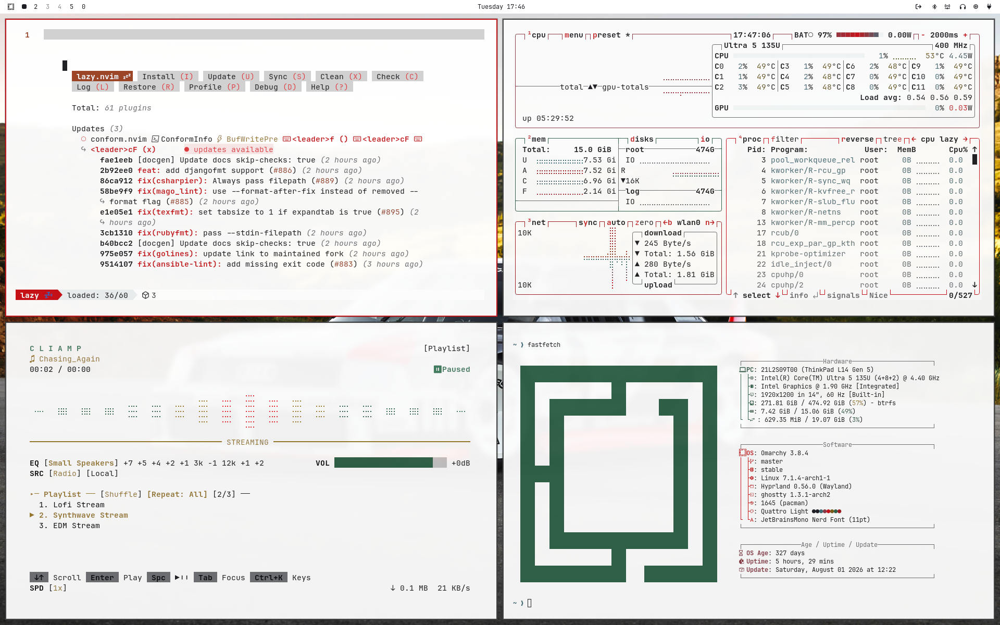
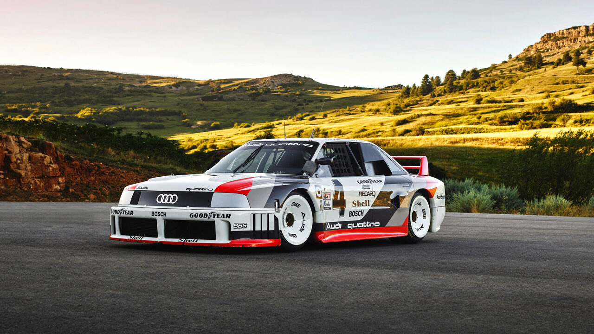
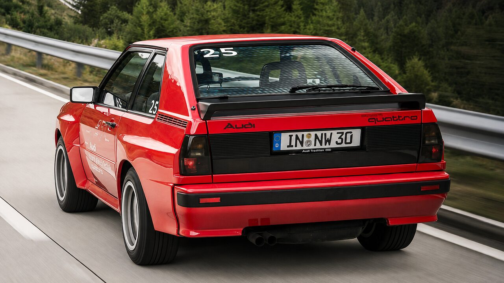
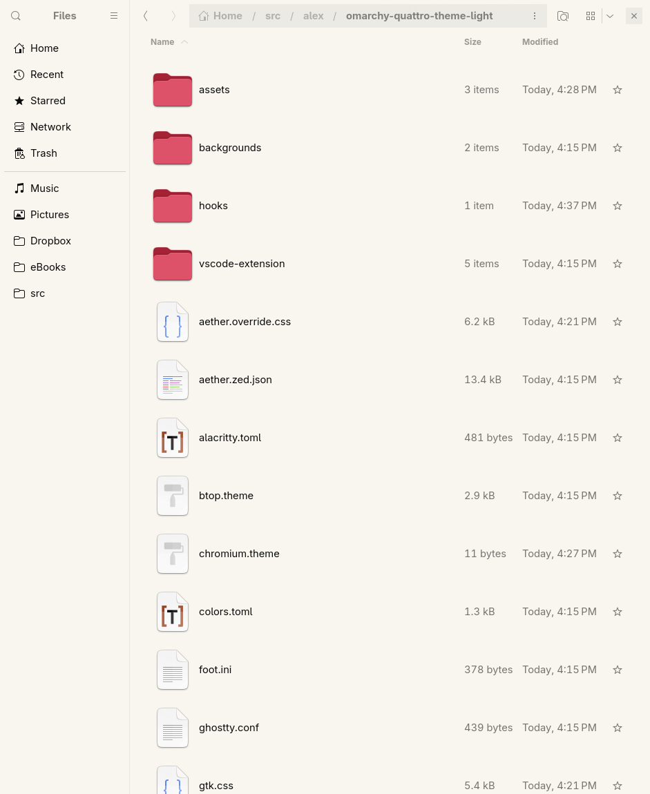
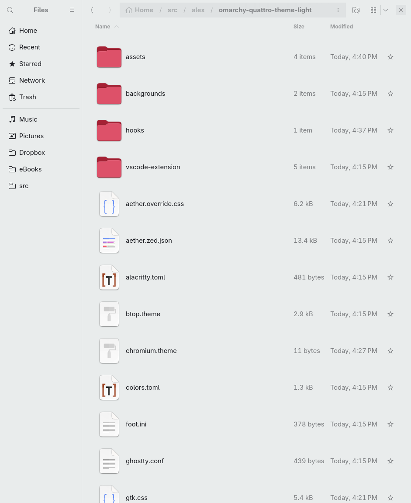

# omarchy-quattro-light-theme



A light Omarchy theme built from the colours of the Audi 90 quattro IMSA GTO
and the Audi Sport quattro: a white background, anthracite as foreground, and
Audi Sport red as the single saturated accent. Every other hue is desaturated
so the red stays the leading colour.

The dark counterpart is
[omarchy-quattro-theme](https://github.com/AlexZeitler/omarchy-quattro-theme).

## Installation

```bash
omarchy theme install https://github.com/AlexZeitler/omarchy-quattro-light-theme
```

## Wallpapers

Click a thumbnail to open the wallpaper in full resolution.

### Audi 90 quattro IMSA GTO

[](backgrounds/audi%2090%20quattro%20imsa%20gto.jpg)

### Audi Sport quattro

[](backgrounds/audi%20sport%20quattro.png)

## Palette

| Role       | Colour    | Source in the photographs |
|------------|-----------|---------------------------|
| Background | `#FFFFFF` | body panels in the light  |
| Surfaces   | `#DCE4E5` | BBS wheels                |
| Foreground | `#1E1F24` | anthracite of the livery  |
| Accent     | `#C81017` | Audi Sport red            |
| Red        | `#9E1B1F` | livery in shadow          |
| Green      | `#2F6248` | pines along the hillside  |
| Yellow     | `#7A5F14` | door graphics             |
| Cyan       | `#3F6E7A` | glass and chrome          |
| Grey       | `#6E6F74` | asphalt                   |

The Audi Sport red is not an approximation. Measured on the rear panel of the
Sport quattro, the paint reads `#CB0214`.

## VS Code

The repository ships a VS Code colour theme under `vscode-extension/`.
Installing the Omarchy theme installs and selects it automatically. To install
it on its own:

```bash
code --install-extension alexanderzeitler.quattro-light-theme
```

## GTK

Omarchy copies `gtk.css` into `~/.config/omarchy/current/theme` but never
deploys it. GTK reads `~/.config/gtk-3.0/gtk.css` and
`~/.config/gtk-4.0/gtk.css` and nothing else, so out of the box the GTK
colours never reach Nautilus or the GTK file dialogs. Nautilus keeps whatever
background it had before, here the cream `#F8F6EF` of an earlier theme:



With the hook, the window takes the background of the theme you picked:



Link the hook once:

```bash
mkdir -p ~/.config/omarchy/hooks/theme-set.d
ln -s ~/.config/omarchy/themes/quattro-light/hooks/gtk \
  ~/.config/omarchy/hooks/theme-set.d/gtk
```

From then on every theme switch writes the GTK colours of whichever theme you
picked, not just this one. The hook only touches the section between its own
markers, so anything you wrote into those files yourself survives. Switching
to a theme without a `gtk.css` removes the section again.

### Going back

No theme shipped with Omarchy carries a `gtk.css`. Switching to one of them
therefore removes the section on its own, and GTK falls back to whatever was
in the file before.

To drop the hook entirely, remove the symlink and run it once by hand:

```bash
rm ~/.config/omarchy/hooks/theme-set.d/gtk
~/.config/omarchy/themes/quattro-light/hooks/gtk --remove
```

## License

MIT
